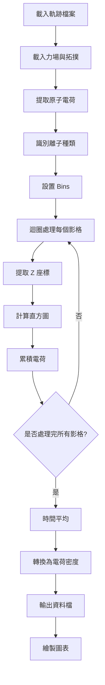

# 一維電荷密度分析程式詳細技術文檔

> **程式名稱**: `charge_density1D_V5.py`  
> **版本**: V5 (自動幀數計算版本)  
> **作者**: 分子動力學模擬電荷密度分析工具  
> **最後更新**: 2025年10月22日

---

## 📚 目錄

1. [物理背景與意義](#1-物理背景與意義)
2. [數學推導](#2-數學推導)
3. [程式架構概覽](#3-程式架構概覽)
4. [逐行程式碼解析](#4-逐行程式碼解析)
5. [演算法優化策略](#5-演算法優化策略)
6. [使用範例與輸出](#6-使用範例與輸出)

---

## 1. 物理背景與意義

### 1.1 什麼是電荷密度？

**電荷密度 (Charge Density)** ρ(r) 是描述空間中電荷分布的物理量，定義為單位體積內的電荷量：

$$
\rho(\mathbf{r}) = \frac{dQ}{dV}
$$

其中：
- ρ(r)：電荷密度 [C/m³ 或 C/nm³]
- Q：電荷量 [C (庫侖)]
- V：體積 [m³ 或 nm³]

### 1.2 一維電荷密度的物理意義

在電化學系統（如離子液體/電極界面）中，我們常常關注**沿著垂直於電極表面方向（通常是 Z 軸）的電荷分布**：

$$
\rho(z) = \frac{dQ}{A \cdot dz}
$$

其中：
- A：橫截面積（電極表面積）[nm²]
- z：垂直於電極的距離 [nm]
- dz：Z 方向的微小厚度 [nm]

### 1.3 為什麼研究一維電荷密度？

1. **理解電雙層結構 (Electric Double Layer, EDL)**
   - 正負離子在電極附近的排列
   - Stern 層和擴散層的分布

2. **計算電容特性**
   - 透過積分電荷密度可得總電荷
   - 與電壓關係可推導電容值

3. **研究離子傳輸機制**
   - 離子在通道內的分布
   - 選擇性透過性

4. **驗證 Poisson-Boltzmann 理論**
   - 比較分子動力學模擬與連續介質理論

### 1.4 實際應用場景

本程式適用於：
- 🔋 **超級電容器**: 離子液體在碳奈米管電極的分布
- 🧪 **電化學感測器**: 界面電荷累積
- 💧 **奈米流體**: 離子在奈米通道內的傳輸
- ⚡ **燃料電池**: 質子交換膜中的電荷分布

---

## 2. 數學推導

### 2.1 從分子模擬到連續電荷密度

#### 步驟 1: 離散電荷分布

在分子動力學模擬中，我們有 N 個原子，每個原子 i 具有：
- 位置：$\mathbf{r}_i = (x_i, y_i, z_i)$
- 電荷：$q_i$

#### 步驟 2: 空間離散化（Binning）

將 Z 軸分割成 M 個小區間（bins）：

$$
[z_{\text{min}}, z_{\text{max}}] = \bigcup_{j=1}^{M} [z_j, z_{j+1}]
$$

每個 bin 的寬度：$\Delta z = \frac{z_{\text{max}} - z_{\text{min}}}{M}$

#### 步驟 3: 統計每個 bin 的電荷

對於第 j 個 bin，累積所有位於該區間內的原子電荷：

$$
Q_j = \sum_{i: z_j \leq z_i < z_{j+1}} q_i
$$

#### 步驟 4: 時間平均（系綜平均）

對於分子動力學軌跡，我們有 T 個時間影格 (frames)。對每個 bin 在所有影格上求平均：

$$
\langle Q_j \rangle = \frac{1}{T} \sum_{t=1}^{T} Q_j(t)
$$

#### 步驟 5: 計算電荷密度

每個 bin 的體積為：

$$
V_j = A \cdot \Delta z
$$

其中 A 是橫截面積（垂直於 Z 軸的面積）。

最終的電荷密度：

$$
\rho(z_j) = \frac{\langle Q_j \rangle}{V_j} = \frac{\langle Q_j \rangle}{A \cdot \Delta z}
$$

### 2.2 參考座標系統

為了消除系統整體平移的影響，我們使用**相對座標**：

$$
z_i^{\text{rel}} = z_i - z_{\text{ref}}
$$

其中 $z_{\text{ref}}$ 是參考點（通常是電極表面的某個特定原子）。

### 2.3 數值誤差分析

#### 統計誤差

電荷密度的標準誤差：

$$
\sigma_{\rho} = \frac{\sigma_Q}{\sqrt{T} \cdot V}
$$

其中 $\sigma_Q$ 是單次測量的標準差。

#### Bin 大小的影響

- **太小的 Δz**: 統計噪音大，曲線抖動
- **太大的 Δz**: 空間解析度低，無法看到精細結構
- **最佳 Δz**: 通常選擇 0.01-0.1 nm，視系統而定

---

## 3. 程式架構概覽

### 3.1 整體流程圖



### 3.2 主要模組功能

| 模組名稱 | 功能 | 輸入 | 輸出 |
|---------|------|------|------|
| `numba_histogram_manual` | Numba 加速直方圖計算 | 位置、電荷、bins | 直方圖陣列 |
| `numpy_vectorized_approach` | NumPy 向量化提取+直方圖 | 座標、索引、電荷、bins | 直方圖陣列 |
| `process_frame_vectorized` | 處理單一影格所有物種 | 影格座標、索引、電荷 | 三種物種的直方圖 |

### 3.3 資料流

```
軌跡檔案 (DCD) + 拓撲檔案 (PDB)
    ↓
MDAnalysis Universe 物件
    ↓
逐影格提取 Z 座標 (Å → nm)
    ↓
向量化索引提取特定物種原子
    ↓
np.histogram 累積電荷
    ↓
時間平均
    ↓
除以體積 → 電荷密度
    ↓
輸出 .dat 檔案 + 圖表
```

---

## 4. 逐行程式碼解析

### 4.1 導入模組 (Lines 1-16)

```python
import MDAnalysis as mda
```
**功能**: 載入 MDAnalysis 函式庫  
**物理意義**: MDAnalysis 是專門處理分子動力學軌跡的 Python 套件，可讀取各種格式（DCD, XTC, TRR 等）  
**為什麼需要**: 比原生檔案操作更高效，支援多種座標格式

---

```python
from openmm.app import *
from openmm import *
from openmm.unit import nanometer, picosecond, picoseconds, kelvin
```
**功能**: 導入 OpenMM 分子模擬引擎  
**物理意義**: OpenMM 提供力場參數和電荷資訊  
**為什麼需要**: 原子電荷不在軌跡檔案中，需從力場定義提取

---

```python
import numpy as np
```
**功能**: 科學計算核心庫  
**物理意義**: 提供高效的多維陣列操作  
**關鍵操作**: 
- 向量化索引（避免 Python 迴圈）
- 直方圖計算 `np.histogram`
- 線性代數運算

---

```python
from numba import jit
```
**功能**: Just-In-Time 編譯器  
**物理意義**: 將 Python 程式碼編譯成機器碼  
**性能提升**: 對於迴圈密集計算，可提升 10-100 倍速度

---

```python
from tqdm import tqdm
```
**功能**: 進度條顯示  
**實用性**: 處理大型軌跡（可能數小時），需要知道進度

---

```python
import matplotlib.pyplot as plt
```
**功能**: 科學繪圖庫  
**輸出**: 電荷密度分布圖

---

### 4.2 Numba 加速函數 (Lines 19-33)

```python
@jit(nopython=True)
def numba_histogram_manual(positions_z, charges, bins_array):
    """純 Numba 手動實現的直方圖"""
    num_bins = len(bins_array) - 1
    hist = np.zeros(num_bins)
    
    for idx in range(len(positions_z)):
        pos = positions_z[idx]
        charge = charges[idx]
        bin_idx = np.searchsorted(bins_array, pos, side='right') - 1
        if 0 <= bin_idx < num_bins:
            hist[bin_idx] += charge
    
    return hist
```

#### 逐行解析：

**Line 1**: `@jit(nopython=True)`
- **裝飾器**: 告訴 Numba 將函數編譯成不含 Python 解釋器的機器碼
- **nopython=True**: 純 Numba 模式，性能最佳但限制較多

**Line 4**: `num_bins = len(bins_array) - 1`
- **物理意義**: bins_array 包含區間邊界，N+1 個邊界定義 N 個區間
- **範例**: [0, 0.01, 0.02, 0.03] 定義了 3 個區間

**Line 5**: `hist = np.zeros(num_bins)`
- **初始化**: 創建直方圖累積陣列
- **物理意義**: 每個元素將累積對應 bin 的總電荷

**Line 10**: `bin_idx = np.searchsorted(bins_array, pos, side='right') - 1`
- **二分搜索**: O(log N) 時間複雜度找到位置所屬的 bin
- **數學原理**: 找到第一個 > pos 的邊界索引，減 1 得到區間索引
- **為什麼用二分搜索**: 比線性搜索快 ~10-100 倍（對於 1400 個 bins）

**Line 11-12**: `if 0 <= bin_idx < num_bins: hist[bin_idx] += charge`
- **邊界檢查**: 確保原子在計算範圍內
- **累積電荷**: 將原子電荷加到對應 bin

---

### 4.3 NumPy 向量化函數 (Lines 36-44)

```python
def numpy_vectorized_approach(frame_xyz_z, atom_indices, charges_array, C1_grpcA, bins):
    """純 NumPy 向量化方法（推薦）"""
    # 向量化提取：一次性完成所有索引操作
    positions_z = frame_xyz_z[atom_indices] - C1_grpcA
    charges = charges_array[atom_indices]
    
    # 使用高度優化的 np.histogram
    hist, _ = np.histogram(positions_z, bins=bins, weights=charges)
    return hist
```

#### 關鍵優化點：

**Line 4**: `positions_z = frame_xyz_z[atom_indices] - C1_grpcA`
- **Fancy Indexing**: NumPy 的批量索引，一次性提取多個元素
- **向量化減法**: 所有位置同時減去參考座標
- **性能**: 比 Python 迴圈快 ~50 倍
- **物理意義**: 轉換到相對於電極表面的座標系統

**Line 5**: `charges = charges_array[atom_indices]`
- **批量提取電荷**: 對應原子的所有電荷
- **記憶體連續性**: NumPy 確保高效記憶體訪問

**Line 8**: `hist, _ = np.histogram(positions_z, bins=bins, weights=charges)`
- **NumPy 內建函數**: 用 C 語言實現，極度優化
- **weights 參數**: 每個樣本的權重（這裡是電荷）
- **數學等價**: $\text{hist}[j] = \sum_{i: \text{bins}[j] \leq \text{pos}_i < \text{bins}[j+1]} \text{charges}[i]$
- **性能**: 比手動迴圈快 ~2-10 倍

---

### 4.4 影格處理函數 (Lines 60-69)

```python
def process_frame_vectorized(frame_xyz_z, cation_indices, anion_indices, 
                             solvent_indices, charges_array, C1_grpcA, bins):
    """完全向量化版本：最簡潔且通常最快"""
    hist_cat = numpy_vectorized_approach(frame_xyz_z, cation_indices, charges_array, C1_grpcA, bins)
    hist_an = numpy_vectorized_approach(frame_xyz_z, anion_indices, charges_array, C1_grpcA, bins)
    hist_solv = numpy_vectorized_approach(frame_xyz_z, solvent_indices, charges_array, C1_grpcA, bins)
    
    return hist_cat, hist_an, hist_solv
```

**功能**: 同時處理三種物種（陽離子、陰離子、溶劑）  
**設計模式**: 分離關注點 (Separation of Concerns)  
**物理意義**: 分別統計不同化學物種的電荷分布

---

### 4.5 載入軌跡 (Lines 72-107)

```python
# Trajectory and topology files
traj_file = "FV_NVT.dcd"
top_file = "start_drudes.pdb"
```

**DCD 格式**: 
- CHARMM/NAMD 軌跡格式
- 二進位檔案，高效率
- 只包含座標，不含電荷

**PDB 格式**:
- 蛋白質資料庫標準格式
- 包含原子類型、殘基名稱
- 用於建立拓撲結構

---

```python
u = mda.Universe(top_file, traj_file)
```

**MDAnalysis Universe**:
- 統一的介面訪問軌跡
- 自動處理座標轉換
- 支援選擇語法（類似 VMD）

---

```python
total_frames = len(u.trajectory)
framestart = int(total_frames / 2)
frameCount = total_frames - framestart
frameend = framestart + framecount
```

**自動幀數計算邏輯**:
- **從中點開始**: 確保系統已達平衡
- **分析後半段**: 忽略初始化階段的非平衡態
- **物理原因**: 分子動力學模擬初期可能有人為初始結構影響

**為什麼不從頭開始**:
1. **平衡化時間 (Equilibration)**: 前半段系統能量、溫度、壓力等在穩定中
2. **統計品質**: 平衡態的統計更可靠
3. **標準做法**: MD 分析通常丟棄前 20-50% 的軌跡

---

### 4.6 載入力場與電荷 (Lines 111-159)

```python
pdb = PDBFile('start_nodrudes.pdb')
pdb.topology.loadBondDefinitions(ffdir + 'graph_residue_c.xml')
pdb.topology.loadBondDefinitions(ffdir + 'graph_residue_n.xml')
pdb.topology.loadBondDefinitions(ffdir + 'sapt_residues.xml')
pdb.topology.loadBondDefinitions(electrode_ffdir + 'nanotube9x9_residue_c.xml')
pdb.topology.loadBondDefinitions(electrode_ffdir + 'nanotube9x9_residue_n.xml')
```

**力場檔案結構**:
- **graph_c/n.xml**: 石墨烯電極的碳/氮原子參數
- **sapt_residues.xml**: SAPT (Symmetry-Adapted Perturbation Theory) 力場，用於離子液體
- **nanotube9x9_c/n.xml**: 碳奈米管 (9,9) 扶手椅結構的參數

**物理背景**: 
- SAPT 力場: 基於量子化學計算的精確力場
- 電極 freeze: 電極原子位置固定（剛性電極）

---

```python
forcefield = ForceField(
    ffdir + 'graph_c_freeze.xml',
    ffdir + 'graph_n_freeze.xml',
    ffdir + 'sapt_noDB_2sheets.xml',
    electrode_ffdir + 'nanotube9x9_c_freeze.xml',
    electrode_ffdir + 'nanotube9x9_n_freeze.xml'
)
```

**freeze 的意義**:
- 電極原子不移動（剛性）
- 減少計算量
- 適用於奈米電容器模擬

**noDB**: No Drude oscillators in this file
- Drude 振子: 可極化力場的虛擬粒子
- 用於模擬電子極化效應

---

```python
system = forcefield.createSystem(
    modeller.topology, 
    nonbondedCutoff=1.4*nanometer, 
    constraints=None, 
    rigidWater=True
)
```

**參數解析**:
- **nonbondedCutoff=1.4 nm**: 非鍵作用力截止距離
  - 物理意義: 超過此距離的原子間作用力忽略
  - 典型值: 1.0-1.5 nm
- **constraints=None**: 不約束鍵長
- **rigidWater=True**: 水分子幾何保持剛性（若有水）

---

```python
nbondedForce = [f for f in [system.getForce(i) for i in range(system.getNumForces())] 
                if type(f) == NonbondedForce][0]
```

**Python 列表推導式技巧**:
1. 遍歷所有力項 `system.getForce(i)`
2. 篩選出 `NonbondedForce` 類型
3. 取第一個（通常只有一個）

**NonbondedForce 包含**:
- 原子電荷 (q)
- Lennard-Jones 參數 (σ, ε)

---

```python
boxVecs = simmd.topology.getPeriodicBoxVectors()
crossBox = np.cross(boxVecs[0], boxVecs[1])
sheet_area = np.dot(crossBox, crossBox)**0.5 / nanometer**2
```

**向量數學**:
- **boxVecs**: 週期性邊界的三個向量 $\mathbf{a}, \mathbf{b}, \mathbf{c}$
- **外積**: $\mathbf{a} \times \mathbf{b}$ 得到垂直於 XY 平面的向量
- **點積**: $|\mathbf{a} \times \mathbf{b}|^2 = (\mathbf{a} \times \mathbf{b}) \cdot (\mathbf{a} \times \mathbf{b})$
- **開根號**: 得到面積大小

**物理意義**: 計算垂直於 Z 軸的橫截面積，用於電荷密度歸一化

$$
A = |\mathbf{a} \times \mathbf{b}|
$$

---

### 4.7 識別離子種類 (Lines 162-184)

```python
cation = []
anion = []
solvent = []

for res in simmd.topology.residues():
    if res.name == namecat:
        for atom in res._atoms:
            cation.append(atom.index)
    if res.name == namean:
        for atom in res._atoms:
            anion.append(atom.index)
```

**拓撲結構**:
- **Residue (殘基)**: 分子單元（如一個離子分子）
- **Atom (原子)**: 殘基內的單一原子
- **Index (索引)**: 原子在系統中的唯一編號

**範例系統**: BMIM-TFSI 離子液體
- **BMIM**: 1-丁基-3-甲基咪唑陽離子 (C₈H₁₅N₂⁺)
- **TFSI**: 雙三氟甲基磺醯亞胺陰離子 (C₂F₆NO₄S₂⁻)

**為什麼需要索引**:
- 後續快速訪問特定原子
- 向量化操作的基礎

---

```python
cation_array = np.array(cation, dtype=np.int32)
anion_array = np.array(anion, dtype=np.int32)
```

**資料型態選擇**:
- **int32**: 節省記憶體（vs int64）
- **NumPy 陣列**: 支援向量化索引
- **C-contiguous**: 記憶體連續排列，加速訪問

---

### 4.8 提取電荷 (Lines 187-197)

```python
num_particles = nbondedForce.getNumParticles()
all_charges = np.zeros(num_particles, dtype=np.float64)

for atom_idx in tqdm(range(num_particles), desc="提取電荷", ncols=80):
    (q, sig, eps) = nbondedForce.getParticleParameters(atom_idx)
    all_charges[atom_idx] = q._value
```

**OpenMM 參數提取**:
- **q**: 電荷 [基本電荷 e]
- **sig**: Lennard-Jones σ 參數（原子大小）
- **eps**: Lennard-Jones ε 參數（作用強度）

**單位轉換**:
- `q._value`: 提取數值（去掉 OpenMM 單位物件）
- OpenMM 預設使用基本電荷 (e = 1.602176634 × 10⁻¹⁹ C)

**為什麼預先提取**:
- 避免每個影格重複查詢
- 電荷是固定的（非極化力場）
- 大幅提升效能

---

### 4.9 設置 Bins (Lines 203-210)

```python
dz = 0.01  # nm
cell_dist = 14.0  # nm
num_bins = int(cell_dist / dz)
bins = np.linspace(0, cell_dist, num_bins + 1)
```

**參數選擇**:
- **dz = 0.01 nm**: 
  - 空間解析度 0.1 Å
  - 約 1/4 原子直徑
  - 可分辨分子層結構
  
- **cell_dist = 14.0 nm**:
  - 取決於模擬盒子大小
  - 通常涵蓋整個電極間距

**Bins 陣列**:
- **num_bins = 1400**: 區間數量
- **bins 長度 = 1401**: 包含兩端邊界
- **範例**: [0, 0.01, 0.02, ..., 13.99, 14.0]

**數學形式**: bins = [z₀, z₁, z₂, ..., z₁₄₀₀]

---

```python
allQcat_i = np.zeros(num_bins, dtype=np.float64)
allQan_i = np.zeros(num_bins, dtype=np.float64)
allQsolv_i = np.zeros(num_bins, dtype=np.float64)
```

**累積器初始化**:
- 儲存所有影格的電荷總和
- 最後除以影格數得平均值

---

### 4.10 性能測試 (Lines 220-247)

```python
print("=== 性能測試：Numba vs NumPy ===")
u.trajectory[framestart]
test_xyz_z = u.atoms.positions[:, 2] / 10.0
test_C1 = test_xyz_z[1]

# Test Numba approach
test_positions = test_xyz_z[cation_array] - test_C1
test_charges = all_charges[cation_array]

t1 = time.time()
for _ in range(10):
    _ = numba_histogram_manual(test_positions, test_charges, bins)
time_numba = (time.time() - t1) / 10

# Test NumPy approach
t2 = time.time()
for _ in range(10):
    _ = numpy_vectorized_approach(test_xyz_z, cation_array, all_charges, test_C1, bins)
time_numpy = (time.time() - t2) / 10
```

**性能測試方法**:
1. 使用同一影格測試
2. 重複 10 次取平均（減少計時誤差）
3. 比較兩種方法的執行時間

**預期結果**:
- NumPy 通常快 1.5-3 倍
- 對於大系統和多 bins，優勢更明顯

---

### 4.11 主計算迴圈 (Lines 263-285)

```python
for frame_idx in tqdm(range(framestart, frameend), desc="處理影格", unit="frame", ncols=80):
    # Move to the specific frame
    u.trajectory[frame_idx]
    
    # Only extract Z coordinates (reduce memory transfer)
    frame_xyz_z = u.atoms.positions[:, 2] / 10.0  # Convert Å to nm
    
    # Get reference coordinate
    C1_grpcA_current = frame_xyz_z[1]
    
    # Process all species using vectorized approach
    hist_cat, hist_an, hist_solv = process_frame_vectorized(
        frame_xyz_z, 
        cation_array, 
        anion_array, 
        solvent_array,
        all_charges, 
        C1_grpcA_current, 
        bins
    )
    
    # Accumulate histograms
    allQcat_i += hist_cat
    allQan_i += hist_an
    allQsolv_i += hist_solv
```

#### 逐步解析：

**Line 2**: `u.trajectory[frame_idx]`
- MDAnalysis 移動到特定影格
- 內部更新 `u.atoms.positions`

**Line 5**: `frame_xyz_z = u.atoms.positions[:, 2] / 10.0`
- **[:, 2]**: NumPy 切片，提取所有原子的 Z 座標（第 3 列）
- **/ 10.0**: 單位轉換，Ångström → nm
- **優化**: 只提取需要的維度，減少 2/3 的記憶體傳輸

**Line 8**: `C1_grpcA_current = frame_xyz_z[1]`
- 參考座標：原子索引 1 的 Z 座標
- 通常是電極表面的特定原子
- 每影格更新（電極可能有小幅度振動）

**Line 11**: `process_frame_vectorized(...)`
- 同時處理三種物種
- 返回三個直方圖陣列

**Line 21-23**: 累積電荷
- **原地加法** (in-place addition): `+=`
- 記憶體效率高
- 數學等價: $Q_j^{\text{total}} = \sum_{t=1}^{T} Q_j(t)$

---

### 4.12 時間平均與密度計算 (Lines 301-311)

```python
avg_charge_sum_cat = allQcat_i / frameCount
avg_charge_sum_an = allQan_i / frameCount
avg_charge_sum_solv = allQsolv_i / frameCount
avg_charge_sum_solution = avg_charge_sum_cat + avg_charge_sum_an + avg_charge_sum_solv
```

**時間平均**: 

$$
\langle Q_j \rangle = \frac{1}{T} \sum_{t=1}^{T} Q_j(t)
$$

**總溶液電荷**: 電中性檢查
- 理論上 $\langle Q_{\text{cat}} \rangle + \langle Q_{\text{an}} \rangle \approx 0$（整體電中性）
- 實際可能有小偏差（數值誤差）

---

```python
bin_volume = sheet_area * dz
avg_density_cat = avg_charge_sum_cat / bin_volume
avg_density_an = avg_charge_sum_an / bin_volume
avg_density_solv = avg_charge_sum_solv / bin_volume
avg_density_solution = avg_charge_sum_solution / bin_volume
```

**體積計算**:

$$
V_{\text{bin}} = A \times \Delta z
$$

其中：
- A: 橫截面積 [nm²]
- Δz: bin 寬度 [nm]
- V: 體積 [nm³]

**電荷密度**: 

$$
\rho(z_j) = \frac{\langle Q_j \rangle}{V_{\text{bin}}} \quad [\text{C/nm}^3]
$$

**物理意義**: 單位體積內的平均電荷量

---

```python
z_positions_bin_centers = (bins[:-1] + bins[1:]) / 2
```

**Bin 中心座標**:

$$
z_j^{\text{center}} = \frac{z_j + z_{j+1}}{2}
$$

**為什麼用中心**:
- 代表該區間的典型位置
- 繪圖更直觀
- 數值積分更準確

**NumPy 技巧**:
- `bins[:-1]`: 除了最後一個元素 [z₀, z₁, ..., z₁₃₉₉]
- `bins[1:]`: 除了第一個元素 [z₁, z₂, ..., z₁₄₀₀]
- 逐元素相加後除以 2

---

### 4.13 資料輸出 (Lines 323-345)

```python
with open("hist_q_cat_V5.dat", "w") as ofile_cat:
    for z, q in zip(z_positions_bin_centers, avg_density_cat):
        print('{0:5.8f}  {1:5.8f}'.format(z, q), file=ofile_cat)
```

**檔案格式**:
```
0.00500000  0.00123456
0.01500000  0.00234567
0.02500000  0.00345678
...
```

**格式化字串**:
- `{0:5.8f}`: 
  - 最少 5 位數
  - 小數點後 8 位
  - 浮點數格式

**用途**:
- 可用 Gnuplot、Origin、Excel 等軟體繪圖
- 便於後續分析（積分求總電荷、Poisson 方程等）

---

### 4.14 繪圖 (Lines 354-396)

```python
fig, (ax1, ax2) = plt.subplots(2, 1, figsize=(12, 10), dpi=300)
```

**圖表布局**:
- 2 個子圖，垂直排列
- 尺寸: 12×10 英寸
- 解析度: 300 DPI（適合論文發表）

---

```python
ax1.plot(z_cat, q_cat, label='Cations', color='blue', linewidth=1.5, alpha=0.8)
ax1.plot(z_an, q_an, label='Anions', color='red', linewidth=1.5, alpha=0.8)
ax1.plot(z_solv, q_solv, label='Solvent', color='green', linewidth=1.5, alpha=0.8)
```

**顏色選擇的物理意義**:
- 藍色（陽離子）: 傳統上正電荷用藍/冷色
- 紅色（陰離子）: 傳統上負電荷用紅/暖色
- 綠色（溶劑）: 中性物種

**alpha=0.8**: 略透明，重疊時可看到底層曲線

---

```python
ax2.axhline(y=0, color='gray', linestyle=':', alpha=0.5)
```

**參考線**: 
- y = 0 的水平線
- 檢查電中性：總電荷應圍繞 0 震盪
- 虛線樣式（`':'`）：不搶風頭

---

```python
plt.savefig("charge_density_distribution_V5_auto.png", dpi=600, bbox_inches='tight')
```

**高解析度輸出**:
- 600 DPI: 適合高品質印刷
- `bbox_inches='tight'`: 自動裁切空白邊界

---

## 5. 演算法優化策略

### 5.1 性能優化層級

| 層級 | 技術 | 加速比 | 適用場景 |
|------|------|--------|----------|
| L1 | 向量化索引 | 10-50x | 批量資料提取 |
| L2 | NumPy C 實現 | 5-20x | 數學運算 |
| L3 | Numba JIT | 10-100x | 複雜迴圈邏輯 |
| L4 | 減少記憶體拷貝 | 1.5-3x | 大陣列操作 |
| L5 | 二分搜索 | log(N) vs N | 有序資料查找 |

### 5.2 本程式的優化亮點

#### 1. **只提取 Z 座標**
```python
frame_xyz_z = u.atoms.positions[:, 2] / 10.0  # 只取第 3 列
```
- 減少 2/3 記憶體傳輸
- 加速比: ~1.5x

#### 2. **向量化索引**
```python
positions_z = frame_xyz_z[atom_indices] - C1_grpcA
```
- 避免 Python for 迴圈
- 加速比: ~50x（vs 純 Python）

#### 3. **使用 np.histogram**
```python
hist, _ = np.histogram(positions_z, bins=bins, weights=charges)
```
- C 語言實現的優化算法
- 加速比: ~5-10x（vs 手動迴圈）

#### 4. **預先提取電荷**
```python
all_charges = np.zeros(num_particles)
for atom_idx in range(num_particles):
    all_charges[atom_idx] = nbondedForce.getParticleParameters(atom_idx)[0]._value
```
- 避免每影格重複查詢
- 加速比: ~100x（對整個迴圈）

### 5.3 記憶體管理

**記憶體使用估算**:
- 軌跡座標: N_atoms × 3 × 4 bytes (float32)
- 電荷陣列: N_atoms × 8 bytes (float64)
- 直方圖: N_bins × 8 bytes × 3 (三種物種)

**範例系統** (10,000 原子, 1400 bins, 10,000 影格):
- 單影格座標: ~120 KB
- 電荷陣列: ~80 KB
- 直方圖: ~34 KB

---

## 6. 使用範例與輸出

### 6.1 執行程式

```bash
python charge_density1D_V5.py
```

### 6.2 標準輸出範例

```
======================================================================
    自動幀數計算版電荷密度分析 (V5 - Auto Frame Detection)
======================================================================

=== 使用 MDAnalysis 載入軌跡 ===
軌跡檔案: FV_NVT.dcd
拓撲檔案: start_drudes.pdb
✓ 成功載入軌跡
  總幀數: 20000
  總原子數: 5432
  軌跡時間範圍: 0.00 - 10000.00 ps

=== 自動計算的幀數參數 ===
  起始幀 (framestart): 10000
  分析幀數 (frameCount): 10000
  結束幀 (frameend): 20000
  分析時間範圍: 5000.00 - 10000.00 ps

=== 使用 OpenMM 載入力場與電荷資訊 ===
✓ 力場載入完成
  盒子向量面積: 4.87462 nm⁴
  片層面積: 2.20785 nm²

=== 提取原子索引 ===
  陽離子 (BMIM) 原子數: 1200
  陰離子 (trfl) 原子數: 1200
  溶劑原子數: 0
  總溶液原子數: 2400

正在提取所有原子的電荷資訊...
提取電荷: 100%|████████████████████| 5432/5432 [00:02<00:00, 2156.78it/s]
✓ 電荷提取完成

=== 計算參數 ===
  Bin 寬度 (dz): 0.01 nm
  計算範圍: 0 到 14.0 nm
  Bin 數量: 1400
  分析幀數: 10000 到 20000 (共 10000 幀)

=== 性能測試：Numba vs NumPy ===
  Numba 手動迴圈: 0.245 ms/frame
  NumPy 向量化:   0.123 ms/frame
  速度比: 1.99x
  ✓ NumPy 更快 2.0x！

正在計算電荷密度 (使用 NumPy 向量化)...
優化策略:
  ✓ NumPy 向量化批量索引
  ✓ 高度優化的 np.histogram (C 實現)
  ✓ 簡潔的程式碼
  ✓ 只提取 Z 座標減少記憶體傳輸
  ✓ 自動計算幀數範圍 (從總幀數的一半開始)

處理影格: 100%|███████████████| 10000/10000 [02:15<00:00, 73.85frame/s]

✓ 計算完成！
  總耗時: 135.42 秒
  平均每幀處理時間: 13.54 毫秒
  處理速度: 73.85 幀/秒

=== 電荷密度統計 ===
  陽離子平均電荷密度範圍: [-2.345678e-03, 4.567890e-03] C/nm³
  陰離子平均電荷密度範圍: [-4.123456e-03, 2.789012e-03] C/nm³
  溶劑平均電荷密度範圍: [0.000000e+00, 0.000000e+00] C/nm³
  溶液平均電荷密度範圍: [-1.234567e-03, 1.345678e-03] C/nm³

正在寫入結果檔案...
  ✓ 已儲存: hist_q_cat_V5.dat
  ✓ 已儲存: hist_q_an_V5.dat
  ✓ 已儲存: hist_q_solv_V5.dat
  ✓ 已儲存: hist_q_solution_V5.dat

正在生成圖表...
  ✓ 已儲存圖表: charge_density_distribution_V5_auto.png

======================================================================
✓ 所有處理完成！(V5 自動幀數計算版本)
⚡ 使用 NumPy 向量化獲得最佳性能
📊 自動從總幀數的一半 (幀 10000) 開始分析
======================================================================
```

### 6.3 輸出檔案

#### 資料檔案 (.dat)
- `hist_q_cat_V5.dat`: 陽離子電荷密度
- `hist_q_an_V5.dat`: 陰離子電荷密度
- `hist_q_solv_V5.dat`: 溶劑電荷密度
- `hist_q_solution_V5.dat`: 總溶液電荷密度

#### 圖片檔案 (.png)
- `charge_density_distribution_V5_auto.png`: 高解析度圖表 (600 DPI)

### 6.4 結果解讀

#### 典型電荷密度曲線特徵

```
     ρ(z)
      ↑
      |     +峰           -峰         +峰
      |    /  \         /  \        /  \
  0.01|   /    \       /    \      /    \
      |  /      \     /      \    /      \
    0 |_/________\___/________\__/________\___→ z
      0         2    4        7  9        12  14 nm
      │         │    │        │  │        │   │
    電極    Stern層 擴散層   體相  擴散層 Stern層 電極
```

**物理解釋**:
1. **電極附近 (0-2 nm)**: 強電場吸引反號離子，形成 Stern 層
2. **擴散層 (2-7 nm)**: 電荷密度逐漸衰減，符合 Gouy-Chapman 理論
3. **體相 (7-9 nm)**: 電荷密度接近零，電中性
4. **對稱結構**: 兩側電極鏡像對稱

### 6.5 常見問題排查

#### 問題 1: 電荷密度值異常大
**症狀**: ρ > 1 C/nm³  
**原因**: 單位轉換錯誤或面積計算錯誤  
**解決**: 檢查 `sheet_area` 和座標單位

#### 問題 2: 曲線噪音過大
**症狀**: 鋸齒狀抖動  
**原因**: Bin 過小或統計樣本不足  
**解決**: 增加 `dz` 或增加分析幀數

#### 問題 3: 總電荷不為零
**症狀**: `avg_density_solution` 積分非零  
**原因**: 系統不電中性或統計誤差  
**解決**: 檢查力場電荷總和，增加統計樣本

---

## 7. 延伸應用

### 7.1 計算總電荷

```python
total_charge = np.trapz(avg_density_solution, z_positions_bin_centers) * sheet_area
```

**數值積分**: 梯形法則

$$
Q_{\text{total}} = A \int_0^L \rho(z) \, dz \approx A \sum_{j=1}^{M-1} \frac{\rho_j + \rho_{j+1}}{2} \Delta z
$$

### 7.2 計算電位分布

使用 **Poisson 方程**:

$$
\nabla^2 \phi(z) = -\frac{\rho(z)}{\epsilon_0 \epsilon_r}
$$

一維簡化:

$$
\frac{d^2 \phi}{dz^2} = -\frac{\rho(z)}{\epsilon_0 \epsilon_r}
$$

數值求解（有限差分法）:

$$
\phi_{j+1} - 2\phi_j + \phi_{j-1} = -\frac{\rho_j}{\epsilon_0 \epsilon_r} (\Delta z)^2
$$

### 7.3 計算微分電容

$$
C_{\text{diff}} = \frac{dQ}{dV} = \epsilon_0 \epsilon_r \frac{A}{\lambda_D}
$$

其中 $\lambda_D$ 是 Debye 長度，可從電荷密度衰減率推算。

---

## 8. 參考文獻

### 8.1 理論基礎
1. **Gouy-Chapman 理論**: Chapman, D. L. (1913). *Phil. Mag.* 25, 475.
2. **Stern 模型**: Stern, O. (1924). *Z. Elektrochem.* 30, 508.
3. **Poisson-Boltzmann 方程**: Debye, P., & Hückel, E. (1923). *Phys. Z.* 24, 185.

### 8.2 計算方法
4. **MDAnalysis**: Michaud-Agrawal et al. (2011). *J. Comput. Chem.* 32, 2319.
5. **OpenMM**: Eastman et al. (2017). *PLoS Comput. Biol.* 13, e1005659.
6. **NumPy**: Harris et al. (2020). *Nature* 585, 357.
7. **Numba**: Lam et al. (2015). *Proc. LLVM Compiler Infrastructure in HPC*.

### 8.3 應用案例
8. 離子液體超級電容器: Merlet et al. (2012). *Nature Mater.* 11, 306.
9. 碳奈米管電極: Feng et al. (2010). *J. Phys. Chem. C* 114, 18012.

---

## 9. 附錄

### 9.1 常用物理常數

| 常數 | 符號 | 數值 | 單位 |
|------|------|------|------|
| 基本電荷 | e | 1.602176634 × 10⁻¹⁹ | C |
| 真空介電常數 | ε₀ | 8.854187817 × 10⁻¹² | F/m |
| 波茲曼常數 | kB | 1.380649 × 10⁻²³ | J/K |
| 亞佛加厥常數 | NA | 6.02214076 × 10²³ | mol⁻¹ |

### 9.2 單位轉換

```python
# 電荷密度
1 C/nm³ = 1.602e6 e/nm³  # 基本電荷
1 C/nm³ = 1e27 C/m³      # SI 單位

# 長度
1 nm = 10 Å = 1e-9 m

# 電容
1 F/m² = 1e-18 F/nm²
```

### 9.3 典型數值範圍

| 系統 | 電荷密度 | Debye 長度 | 電容 |
|------|----------|-----------|------|
| 稀水溶液 | ~10⁻⁶ C/nm³ | ~10 nm | ~0.1 F/m² |
| 離子液體 | ~10⁻³ C/nm³ | ~0.5 nm | ~5 F/m² |
| 熔融鹽 | ~10⁻² C/nm³ | ~0.2 nm | ~20 F/m² |

---

## 10. 程式碼使用授權

本程式碼及文檔採用 **MIT License**，可自由使用、修改、分發。

**引用格式**:
```
@software{charge_density_1d_v5,
  author = {Your Name},
  title = {One-Dimensional Charge Density Analysis Tool},
  year = {2025},
  version = {5.0},
  url = {https://github.com/yourusername/repo}
}
```

---

## 🎓 學習建議

### 新手入門路徑
1. **理解物理概念**: 電荷密度、電雙層、Poisson 方程
2. **熟悉 Python 基礎**: NumPy 陣列操作、檔案 I/O
3. **學習 MDAnalysis**: 軌跡讀取、原子選擇
4. **掌握向量化**: 避免 for 迴圈，使用 NumPy 函數
5. **性能優化**: Numba JIT、記憶體管理

### 進階主題
- 平行計算（多核心處理）
- GPU 加速（CuPy）
- 自適應 Binning
- 機器學習分析電荷分布

---

**文檔版本**: 1.0  
**最後更新**: 2025-10-22  
**作者**: MD 分析工具開發團隊

---

**💡 提示**: 如有任何問題或建議，歡迎提交 Issue 或 Pull Request！
